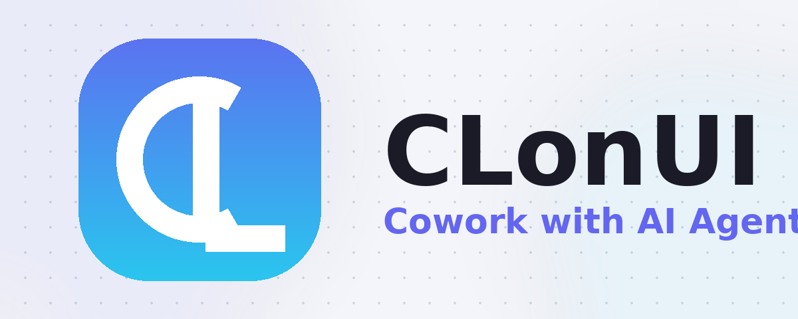

<p align="center">
  
</p>

<p align="center">
  
  &nbsp;
  
  &nbsp;
  
</p>

<p align="center">
  <strong>A free, open-source Cowork app with AI Agents.</strong><br>
  <em>Built-in Agent | Zero Setup | Any API Key | Multi-Agents | Remote Access | Cross-Platform | 24/7 Automation</em>
</p>

<p align="center">
  <strong>English</strong> | <a href="./docs/readme/readme_ch.md">简体中文</a> | <a href="./docs/readme/readme_tw.md">繁體中文</a> | <a href="./docs/readme/readme_jp.md">日本語</a> | <a href="./docs/readme/readme_ko.md">한국어</a> | <a href="./docs/readme/readme_es.md">Español</a> | <a href="./docs/readme/readme_pt.md">Português</a> | <a href="./docs/readme/readme_tr.md">Türkçe</a> | <a href="./docs/readme/readme_ru.md">Русский</a> | <a href="./docs/readme/readme_uk.md">Українська</a>
</p>

---

## 📋 Quick Navigation

<p align="center">

[Cowork in Action](#-cowork-in-action) ·
[Why Choose CLonUI?](#-why-choose-clonui) ·
[Quick Start](#-quick-start) ·
[Community](#-community--support)

</p>

---

## Cowork — AI Agents That Work Alongside You

**CLonUI is more than a chat client.** It's a Cowork platform where AI agents work alongside you on your computer — reading files, writing code, browsing the web, and automating tasks. You see everything the agent does, and you're always in control.

|                                 | Traditional AI Chat Clients | **CLonUI (Cowork)**                                                                                                     |
| :------------------------------ | :-------------------------- | :---------------------------------------------------------------------------------------------------------------------- |
| AI can operate on your files    | Limited or No               | **Yes — built-in agent with full file access**                                                                          |
| AI can execute multi-step tasks | Limited                     | **Yes — autonomous with your approval**                                                                                 |
| Remote access from phone        | Rarely                      | **WebUI + Telegram / Lark / DingTalk / WeChat**                                                                         |
| Scheduled automation            | No                          | **Cron — 24/7 unattended**                                                                                              |
| Multiple AI Agents at once      | No                          | **Claude Code, Codex, Qwen Code, Hermes Agent, Snow CLI, Cursor Agent and 13+ more — auto-detected, unified interface** |
| Price                           | Free / Paid                 | **Free & Open Source**                                                                                                  |

---

## Built-in Agent — Install & Go, Zero Configuration

CLonUI ships with a complete AI agent engine. Unlike tools that require you to install CLI agents separately, **CLonUI works the moment you install it**.

- **No CLI tools to install** — the agent engine is built in
- **No complex setup** — paste any API key to get started
- **Full agent capabilities** — file read/write, web search, image generation, MCP (Model Context Protocol) tools
- **Ready-to-use assistants** — 21 built-in professional assistants (Cowork, PPT Creator, Word Creator, Word Form Creator, Excel Creator, Morph PPT, Morph PPT 3D, Pitch Deck Creator, Dashboard Creator, Academic Paper Writer, Financial Model Creator, and more) ready to use immediately

### **Office assistants — PPT, Word & Excel**

These tracks ship with the app: **Morph PPT** presets and the **`pptx` / `docx` / `xlsx` skills** (see `assistant/` presets and `skills/` in the repo). Want document/table output? CLonUI's document skills help PPT (Morph), Word (`.docx`), and Excel (`.xlsx/.xlsm/.csv`) go from request to deliverable faster and more reliably. The three assistant types map to file workflows, and the final outputs are directly editable and reusable.

#### **PPT assistant**

> **Output:** editable Morph PPT (`.pptx`)
> Morph-animated slide-to-slide transitions with coherent story pacing.

#### **Word assistant**

> **Output:** editable Word (`.docx`)
> Paper/thesis writing and production-ready document editing via the `docx` skill.

#### **Excel assistant**

> **Output:** usable Excel (`.xlsx/.xlsm/.csv`)
> Generate/refresh spreadsheets with `xlsx` for analysis, auto-formatting, and charts.

---

## Multi-Agent Mode — Already Have CLI Agents? Bring Them In

If you already use Claude Code, Codex, Hermes Agent, or OpenClaw, CLonUI auto-detects them and lets you Cowork with all of them — alongside the built-in agent.

**Supported Agents:** Built-in Agent (zero setup) • Claude Code • Codex • Qwen Code • Goose AI • OpenClaw • Augment Code • CodeBuddy • Kimi CLI • OpenCode • Factory Droid • GitHub Copilot • Qoder CLI • Mistral Vibe • Nanobot • Snow CLI • Hermes Agent • Cursor Agent and more

- **Auto Detection** — automatically recognizes installed CLI tools
- **Unified Interface** — one Cowork platform for all your AI agents
- **Parallel Sessions** — run multiple agents simultaneously with independent context
- **MCP Unified Management** — configure MCP (Model Context Protocol) tools once, automatically sync to all agents — no need to configure each agent separately
- **YOLO Mode** (auto-approve all agent actions without manual confirmation) / **Full-Auto Mode** — one click to bypass permission prompts; all agents support full-auto mode for unattended execution

### Team Mode — Coordinated Multi-Agent Collaboration

Leader orchestrates a team of sub-agents: it assigns tasks, tracks progress, and aggregates results. CLonUI ships with a built-in team runtime so you can split large jobs across specialized agents without leaving the app.

---

## Why Choose CLonUI?

CLonUI turns a plain command-line AI agent into a friendly, modern desktop companion — and then layers a full feature set on top:

- **Cowork, not just chat** — agents act on your machine with your permission.
- **Zero-setup built-in agent** — no separate CLI to install; paste a key and go.
- **Any model, any provider** — bring your own API key for OpenAI, Anthropic, Google, OpenRouter, or a local endpoint.
- **Remote control** — drive your agents from your phone via the WebUI or Telegram.
- **24/7 automation** — schedule recurring tasks with the built-in cron engine.
- **Cross-platform** — native builds for macOS, Windows, and Linux, plus a mobile companion.

---

## 🚀 Quick Start

### 1. Download & Install

Build the latest installer for your platform from source (see Build from Source below), or grab a release from the [Releases page](https://github.com/YassinAliYassin/CLonUI/releases) once published. macOS, Windows, and Linux installers are provided.

### 2. Launch & Add a Key

Open CLonUI, drop in any LLM API key (or point it at a local model), and start chatting. The built-in agent is ready immediately — no extra setup.

### 3. (Optional) Connect Your Favorite CLI Agents

Already using Claude Code, Codex, or Hermes Agent? CLonUI auto-detects them and pulls them into the same unified Cowork workspace.

---

## 🛠️ Build from Source

CLonUI is a Bun monorepo (Electron desktop + web + CLI packages).

```bash
# install dependencies
bun install

# run the desktop app in dev mode
bun run dev

# build installers for the current platform
bun run build

# run tests
bun run test
```

See [CONTRIBUTING.md](CONTRIBUTING.md) for the full development guide, architecture overview, and coding conventions.

---

## 📦 What's Inside

| Package                | Purpose                                          |
| :--------------------- | :----------------------------------------------- |
| `@clonui/desktop`     | The Electron desktop application                |
| `@clonui/web-host`    | Web rendering host used by the WebUI / remote UI |
| `@clonui/web-cli`     | `clonui-web` CLI for headless / server use      |
| `@clonui/shared-scripts` | Shared build & release scripts                |

---

## 🌍 Community & Support

- **GitHub Discussions** — ask questions and share what you build: https://github.com/YassinAliYassin/CLonUI/discussions
- **Issues** — report bugs or request features: https://github.com/YassinAliYassin/CLonUI/issues
- **Built by SolidAI** — a sovereign LLM platform for African businesses and communities.

---

## 📜 License

CLonUI is released under the [Apache License 2.0](LICENSE).

Copyright © SolidAI. This project is based on the AionUi open-source project (Copyright © iOfficeAI), licensed under Apache-2.0.
